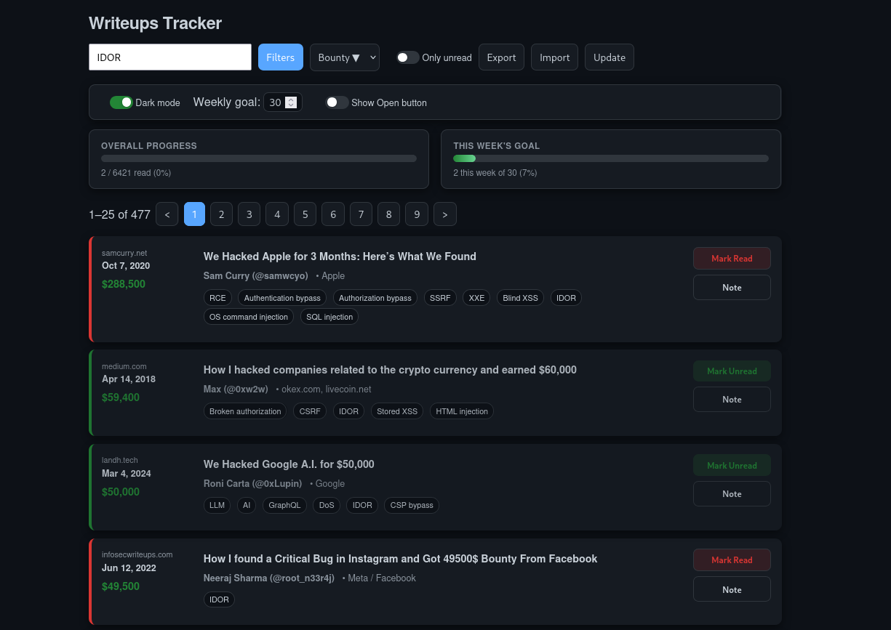
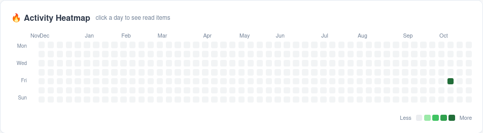
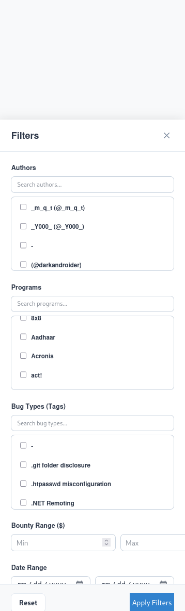

# 📚 Writeups Tracker — Local Pentester.Writeups Reader & Progress Tracker

A lightweight, local-first web app to browse and track pentest writeups (from `https://pentester.land/writeups.json`) on your Kali Linux machine.
Runs entirely locally: a tiny Flask backend caches the writeups and stores `userdata.json`, while a static frontend provides filtering, pagination, read/unread tracking, comments, bounty sorting, and a modern GitHub-style heatmap of activity.

Use it to keep a study-focused reading workflow, track progress across browsers on the same machine, and analyze reading cadence.

---

https://github.com/user-attachments/assets/92a0b105-4b21-4dcd-9af7-51d6794b3c05


## Quick TL;DR

```bash
# clone or copy files into ~/writeups-tracker
cd ~/writeups-tracker
# install deps
pip3 install --user flask requests
# start the app (starts backend and opens browser)
./run.sh
# or run manually
python3 backend.py
# open http://127.0.0.1:5000 in your browser
```

---


## ✨ Features

### Tracking & Progress

  * **Read Status:** Easily mark any writeup as **Read** (green border) or **Unread** (red border) with a single click on the list item.
  * **Personal Notes:** Add private **comments/notes** to any writeup using the "Note" button.
  * **Overall Progress:** Visualize your total writeup read percentage.
  * **Weekly Goal:** Set and track a weekly reading goal with a dedicated progress bar.
  * **Read Heatmap:** A GitHub-style **54-week heatmap** visualizes your daily reading activity. Click on any day to see the list of writeups read on that date.

### Filtering & Organization

  * **Advanced Filter Sidebar:** Open the "Filters" panel for powerful, multi-select filtering options:
      * Filter by **Author**.
      * Filter by **Program** (supports writeups with multiple programs).
      * Filter by **Tags/Bugs** (e.g., XSS, RCE, SQLi).
      * Filter by **Bounty** amount range (Min/Max).
      * Filter by **Date** range (Publication or Added Date).
  * **Search Bar:** Quick-filter the list by Title, Author, Tags, and Description.
  * **Sorting:** Sort the list by Date, Title, Author, or Bounty amount (Ascending/Descending).
  * **Only Unread Toggle:** Quickly hide all items you've already marked as read.

### UX & Data Management

  * **Curvy Modern UI:** A clean, modern aesthetic with curvy buttons and input fields (8px radius) for improved look and feel.
  * **Dark/Light Mode:** Toggle between dark and light themes.
  * **Data Portability:** **Export** and **Import** all of your tracking data (`userdata.json`) to easily move your progress between machines or back it up.
  * **Pagination:** Loads the writeups in pages (25 items per page) to ensure fast rendering, even with thousands of entries.
  * **Update Mechanism:** Button to trigger a backend refresh of the main `writeups.json` data.


---

# 🔧 Installation (Kali Linux)

1. Create project folder and files (or copy the code supplied earlier).
2. Install Python and dependencies:

   ```bash
   sudo apt update
   sudo apt install -y python3-pip
   pip3 install --user flask requests
   ```
3. Make `run.sh` executable:

   ```bash
   chmod +x run.sh
   ```
4. Run:

   ```bash
   ./run.sh
   ```

   or

   ```bash
   python3 backend.py
   ```

   Then visit: `http://127.0.0.1:5000`

---


## 📝 Usage & UX Notes

| Action | How to Perform | Note |
| :--- | :--- | :--- |
| **Mark Read/Unread** | Click anywhere on the writeup row. | Toggles the read status and updates the progress. |
| **Search** | Type in the top search bar. | Use the keyboard shortcut `/` to focus the search bar instantly. |
| **Advanced Filtering** | Click the **Filters** button. | Allows multi-select on Authors, Programs, and Tags, plus range filtering for Bounty and Date. |
| **Add/Edit Note** | Click the **Note** button next to a writeup. | Opens a modal to save personal comments; notes are displayed under the list item. |
| **Toggle Unread** | Click the "Only unread" toggle switch. | Use the keyboard shortcut `u` for a quick toggle. |
| **View Daily Reads** | Click a colored square on the **Heatmap**. | Opens a modal showing the titles of all writeups recorded as read on that specific date. |
| **Update Data** | Click the **Update** button. | This sends a request to the backend to refresh the core `writeups.json` data, if the backend is configured to do so. |

-----

# 📁 Project structure

```
writeups-tracker/
├─ backend.py        # Flask backend & caching logic
├─ run.sh            # convenience script to start backend + open browser
├─ writeups.json     # cached source JSON from pentester.land
├─ userdata.json     # stores { read: {...}, comments: {...}, settings: {...} }
└─ static/
   ├─ index.html
   ├─ style.css
   └─ script.js
```

---

# 🧭 Troubleshooting

* If the UI shows `No writeups matched`:

  * Check `writeups.json` shape: it may be `{ "data": [...] }`. The backend unwraps `.data` now; if not, restart backend.
  * Inspect backend endpoint:

    ```bash
    curl -s http://127.0.0.1:5000/api/writeups | jq '.[0:2]'
    ```
* If backend fails to fetch `pentester.land` on first run: copy the remote file manually into `writeups.json`.
* To stop a running backend started by `run.sh`:

  ```bash
  pkill -f backend.py
  ```
* changing default browser opening 
   change `set -e` line on run.sh  
---

# 🔮 Future checklist — study-focused redesign & UX improvements

## Current (OK — works perfectly)

* [✅] Local Flask backend + caching (`writeups.json`) and shared `userdata.json`.
* [✅] Read/unread tracking + progress bars.
* [✅] Export/Import user progress.
* [✅] Filters (tags / bug classes) + search + sorting.
* [✅] Pagination (25 per page) and bounty sorting/display.
* [✅] Heatmap (GitHub-style) for reads, hover tooltip + click modal.


## ✅ Future Checklist

  * [ ] **Stats Page:** Create a dedicated view for statistics, such as "Top 10 most frequently read Programs/Authors."
  * [ ] **Direct Filter Links:** Allow clicking on a badge (tag or program) within a list item to instantly filter the list by that value.
  * [ ] **"My Notes" View:** A consolidated page that displays all writeups that have user comments/notes.
  * [ ] **Local Data Backup:** Implement an automatic daily/weekly backup feature for `userdata.json`.
  * [ ] **Date Grouping:** Add a feature to group the writeup list by Year or Month.
---

### Screenshots



